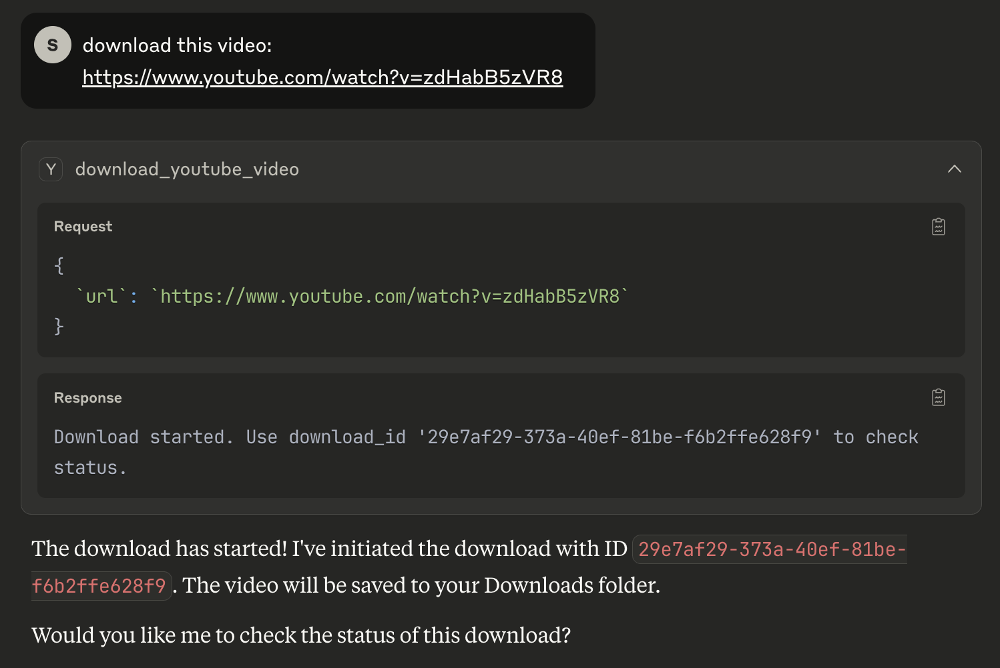
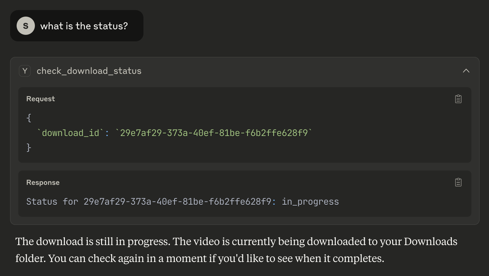

# YouTube Downloader MCP Server 📺

This project is an **MCP (Multi-Channel Protocol) server** that allows Claude (or any MCP-compatible AI agent) to download YouTube videos directly to your computer's Downloads folder. It is designed for seamless integration with Claude's tool-calling capabilities.

## Features
- Exposes two MCP tools:
  - `download_youtube_video(url: str)`: Starts a YouTube video download in the background and returns a download ID.
  - `check_download_status(download_id: str)`: Lets you check the status of a download (in progress, completed, or error).
- Downloads are saved to your system's Downloads folder.
- Fully async/background operation.

## Installation

1. **Clone the repository:**
   ```sh
   git clone <your-repo-url>
   cd youtube-downloader-mcp
   ```

2. **Install Poetry (if you don't have it):**
   ```sh
   pip install poetry
   ```

3. **Install dependencies:**
   ```sh
   poetry install
   ```

## Running the MCP Server

Run the server using Poetry:

```sh
poetry run python endpoints.py
```

You should see a message like:
```
Running YouTube Downloader MCP server
```

## Using with Claude

1. **Add this server as a tool in Claude's settings** (or use the Claude desktop app's "Add MCP server" feature).
    - Update your `claude_desktop_config.json` adding this MCP Server configuration:
    - ```
        {
            "mcpServers": {
                "youtube-dowloader": {
                "command": "poetry",
                "args": [
                    "--directory",
                    "<your_project_path>",
                    "run",
                    "python",
                    "endpoints.py"
                ]
                }
            }
        }
        ```
    - For more info, please check this link https://modelcontextprotocol.io/quickstart/user


2. Claude will automatically discover the following tools:
   - `download_youtube_video(url: str)`
   - `check_download_status(download_id: str)`

   
3. **Example workflow:**




## Running Tests

To run the unit tests for the YoutubeDownloader service, use:

```sh
poetry run python -m unittest tests/test_services.py
```

All tests are located in the `tests/` directory. These tests use mocks, so no real downloads or system calls are made.

## Notes
- **FFmpeg is required** for video merging. If you don't have it, download from [ffmpeg.org](https://ffmpeg.org/download.html) and ensure it's in your PATH.
- All downloads go to your system's Downloads folder.
- This server is designed for use with Claude, but any MCP-compatible client can use it.

## Troubleshooting
- If you see errors about non-JSON output, make sure you are running the latest code (all yt-dlp logs are redirected to stderr).
- If you get `ffmpeg not installed` errors, install FFmpeg and restart the server.
- If you have issues with status not updating, ensure only one server instance is running at a time.

## License
MIT


